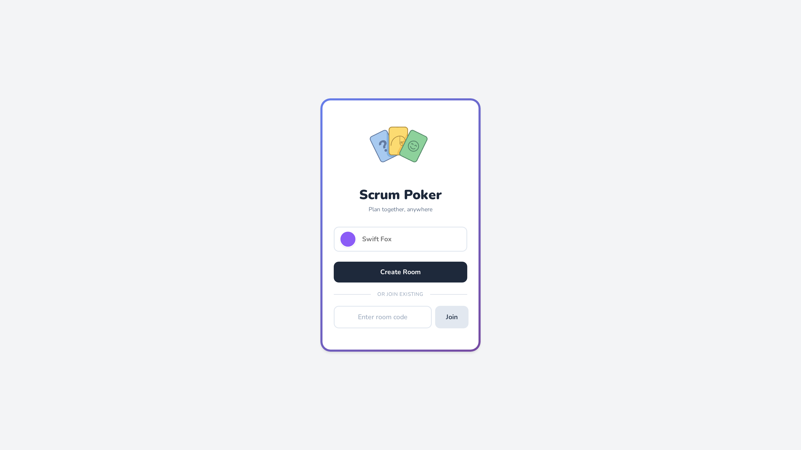
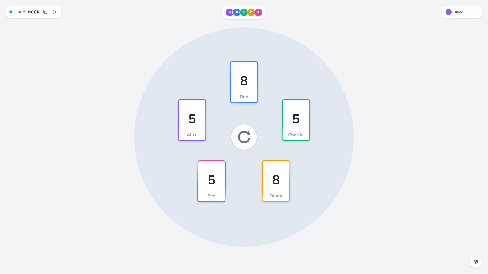

# Joyful Scrum Poker

<p align="center">
  
</p>

<p align="center">
  A fun, physics-based Scrum Poker estimation game that runs entirely in your browser.
</p>

<p align="center">
  <a href="https://tools.joadn.com/spkr/"><strong>Try it live</strong></a>
</p>

---

## No Backend Required

This application is **100% serverless**. There are no servers to maintain, no databases to manage, and no infrastructure costs.

Players connect directly to each other using **peer-to-peer WebRTC connections**, with peer discovery handled through the **BitTorrent DHT network**. Just share a 6-character room code and start estimating.

## Demo

<p align="center">
  
</p>

<p align="center">
  
  
</p>

## How It Works

1. Create a room and share the code with your team
2. Everyone joins using the same room code
3. Pick your estimate from the Fibonacci deck
4. Watch cards fly across the table with satisfying physics
5. Reveal all votes simultaneously when everyone's ready

## Features

- **Real-time P2P sync** — No central server, direct browser-to-browser communication
- **Physics-based cards** — Cards bounce, slide, and collide realistically
- **Single-file deployment** — The entire app bundles into one HTML file
- **Mobile friendly** — Works on phones and tablets
- **No sign-up** — Just create a room and go

## Tech Stack

Built with vanilla JavaScript and two excellent libraries:

- **[Trystero](https://github.com/dmotz/trystero)** — Serverless WebRTC matchmaking using BitTorrent DHT. This library is the magic that makes backend-free multiplayer possible.
- **[Matter.js](https://brm.io/matter-js/)** — 2D physics engine that makes the cards feel satisfying to throw.

## Development

```bash
# Install dependencies
npm install

# Build the single-file app
npm run build

# Generate screenshots (requires Playwright)
npm run screenshots
```

The build process bundles all JavaScript, CSS, and the logo into a single `public/index.html` file.

## License

MIT
